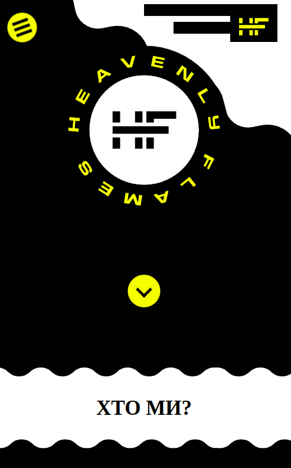

# HEAVENLY FLAMES SITE

A website created for Feavenly Flames.

## Description
This project was made for Feavenly Flame.  
Project is not finished.

## Screenshots

## Technologies Used
- HTML
- CSS

## How to Run
Just open the `index.html` file in any modern web browser.

Or visit the site here: <a href="https://taras-bilyk.github.io/Heavenly_Flames/">https://taras-bilyk.github.io/Heavenly_Flames/</a>

## Project Structure
- `index.html` — main page
- `css/` — stylesheets
- `img/` — images

## Project Goal
Real commercial project? but not released.

---

